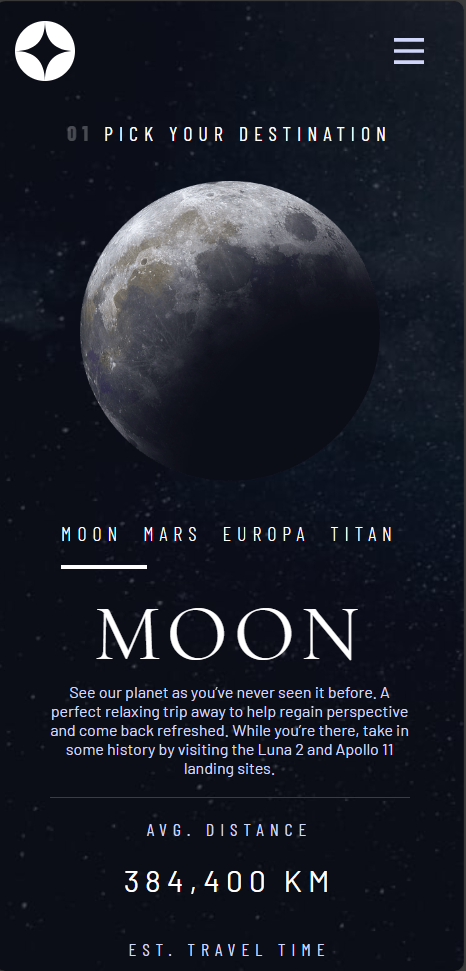

# Galactic Getaway Explorer - Space Tourism Website

## Project Description:

Welcome to "Galactic Getaway Explorer" – a multi-page space tourism website designed to challenge and enhance your frontend development skills. This project is part of the Frontend Mentor challenges, providing an opportunity to showcase your proficiency in building responsive and visually appealing web interfaces.

The goal is to meticulously replicate the provided design, showcasing your mastery in HTML5, CSS3, Sass, JavaScript, and responsive web design for mobile devices. Additionally, ensure code quality and consistency using ESLint for linting.

## [Live Link](https://main--mansy-space-tourism.netlify.app/)

## [Challenge Link](https://www.frontendmentor.io/challenges/space-tourism-multipage-website-gRWj1URZ3)

## Screenshots
### 1.Desktop


### 2.Mobile
<p align="center">
  
</p>

<p align="center">
  
</p>

<p align="center">
  
</p>

### Skills Demonstrated:

1. **HTML5:** Structured the project with semantic HTML tags for better accessibility and SEO.
2. **CSS3:** Styled the pages using CSS3 to match the provided design.
3. **Sass:** Utilized Sass for more maintainable and organized stylesheets.
4. **JavaScript:** Implemented interactive features using JavaScript to enhance user experience.
5. **ESLint:** Ensured code quality and consistency using ESLint for linting.
6. **Responsive Web Design:** Created a responsive layout for mobile devices and ensured cross-browser compatibility.

### Project Structure:

The project consists of multiple pages related to space tourism, including sections such as Home, Destination, Crew, and Technology. Each page is designed to be visually appealing and user-friendly.

### Getting Started:

1. Clone the repository:

   ```bash
   git clone https://github.com/MMansy19/space-tourism.git
   ```

2. Navigate to the project directory:

   ```bash
   cd space-tourism
   ```

3. Open the `home.html` file in your preferred web browser.

### Project Structure:

```
space-tourism-website/
│
├── assets/
│   ├── shared/
│   │   ├── logo.svg
│   │   ├── icon-hamburger.svg
│   │   └── icon-close.svg
│   ├── technology/
│   │   ├── image-launch-vehicle-portrait.jpg
│   │   ├── image-spaceport-portrait.jpg
│   │   └── image-space-capsule-portrait.jpg
│   └── ... (other project assets)
│
├── static/
│   └── ... (compiled CSS, JS, and Sass files)
│
├── home.html
├── destination.html
├── crew.html
├── technology.html
│
├── styles/
│   ├── main.css
│   └── main.scss
│
├── scripts/
│   └── main.js
│
├── .eslintrc.js
└── README.md
```

### Contributing

If you find any issues or have suggestions for improvements, feel free to open an issue or submit a pull request. Contributions are welcome!

### Acknowledgments:

- [Frontend Mentor](https://www.frontendmentor.io/): Providing challenges to enhance frontend development skills.

Enjoy exploring the Galactic Getaway Explorer! 🚀

## Contact

Feel free to reach out to me any time. I prefer to talk over email, especially since we may be in different time zones.

- Email: [mahmoud2abdalfattah@gmail.com](mailto:mahmoud2abdalfattah@gmail.com)
- [LinkedIn](https://www.linkedin.com/in/mahmoud-mansy-a189a5232/)

### Author:

[Mahmoud Mansy](https://github.com/MMansy19)
